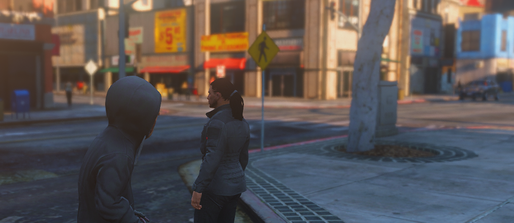

# **Disable Accidental Punch** 🤛🏽❌ [Standalone-FiveM-Script]
### Are you getting hit/punched by other players unintentionally? 👊🏽😕

### Just because they pressed the left mouse button? No Worries! 🤗💦 I got you.

<br>
<p align="center">  </p>
<br>

## Features 💼
- 🐭 Players should hold the **RIGHT Mouse Button** _(target)_ to punch for someone.

---
## Requirements 🧰
- **Nothing.** Oh! But, Ofc You need a FiveM server. 😜
- This is a **standalone** script. It means this works on any framework. (QB, ESX, Whatever)

---
## Installation 🐌

```
- download the script from my tebex.store (link down below ↓)
- unzip the file → mrm-safePunch
- place it somewhere in your server's resource folder
```

```
- add → ensure mrm-safePunch ...to your server.cfg
- restart the server
```

### **📍 Keep in mind:**
> The script will not work, if you change the resource folder name to something else, other than **mrm-safePunch**. 

---
## 🌎 [Download](https://mrm.tebex.io/package/5497215) :
> You can download the script from my **[Tebex Store](https://mrm.tebex.io/package/5497215)**.

---
<details>
<summary>Tags</summary>
Safe Punch, Anti Punch, Disable Punch, Target Punch, Safe Melee, Anti Melee, Disable Melee, Target Melee
</details>
